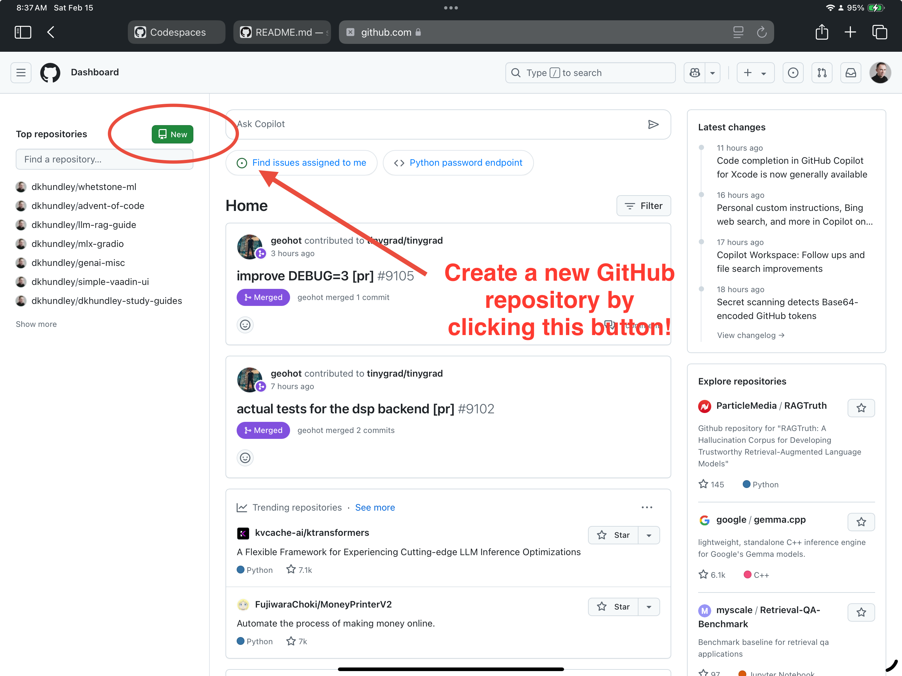
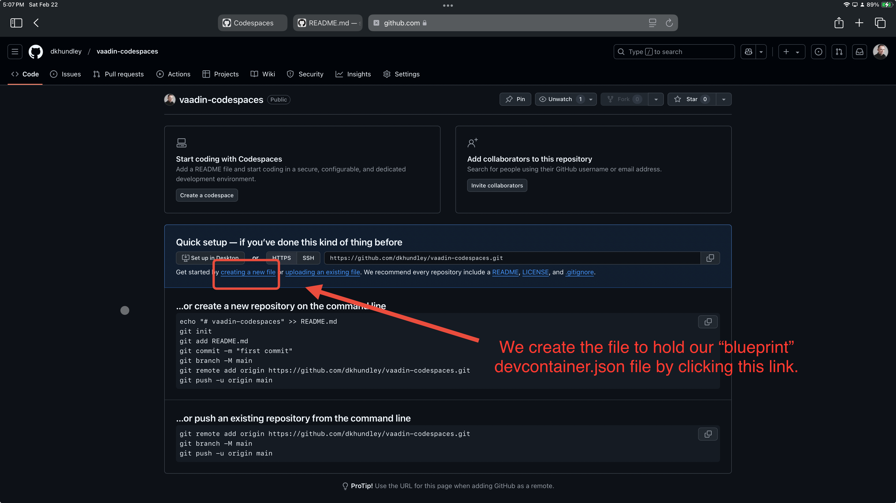

# Building a Simple Java-Based UI with Vaadin
In this repository, I will share how you can build a simple Java-based UI with **Vaadin**. Vaadin is an open source framework that allows users to build a simple web-based user interface using their drag-and-drop builder.

To keep things easy and simple to understand, we're specifically going to be building a **pizza maker** (or, I guess, pizza order taker, if we're being specific). We're going to keep it simple by building only two screens, or *views*, which include:

1. A form for the user to build their pizza, including the size, crust, and toppings.
2. A confirmation screen that shows the user what they've ordered along with subtotal, tax, tip, and final total.


### Video Tutorial
If you're more of a visual learner, I completed a complementary video tutorial over on my YouTube channel [at this link](https://www.youtube.com/live/SzNTJ8aDEOo?si=3hrxXng3LYA1QRLS). The video covers a good chunk of the content in this text-based tutorial below, but isn't all inclusive of everything we cover in the text-based tutorial. I have also included timestamps in the description of the YouTube video if you would like to hop around to specific sections.

### Navigating This Tutorial
What you are reading right now is what is referred to as a **README** file, which uses a special kind of documentation style called **markdown**. Many developer's use markdown to write technical documentation, so it is GitHub's preferred way to display documentation, as you are reading right now! Because this tutorial is pretty lengthy, you can jump around to various sections by clicking the icon as indicated in the screenshot below.


## Prerequisites
There are two core things that we're going to be doing across this tutorial:

1. Building the Vaadin UI via Vaadin's drag-and-drop builder.
2. Altering the code we'll get from the drag-and-drop builder to make it work for our pizza maker.

The drag-and-drop builder is simply accessed by visiting Vaadin's website, so we don't need anything particularly special here. (Note: As an iPad user, I did find that Vaadin's builder didn't like Safari for iPad, but it worked just fine with Opera on the iPad. Go figure.)

For the code, this is where things get a bit trickier. I have confirmed that this code will work on both **macOS** and **Windows**, but I'm not able to confirm anything about Chromebooks. I'll provide installation instructions for both macOS and Windows, but for the sake of simplicity, I'm actually going to recommend **GitHub Codespaces**.

### What is GitHub Codespaces?
GitHub Codespaces is a cloud-based development environment that allows you to code directly from your browser. In order to use GitHub Codespaces, all you need to do is to sign up for a free GitHub account. Now, there is a quota limitation on how much you can use GitHub Codespaces each month, but I've found the free tier is pretty generous. If you'd like to learn additional details about GitHub Codespaces, you can visit their [official website](https://github.com/features/codespaces).

Here are the reasons I like GitHub Codespaces:

- **Minimal fussing around with installations**: While I will provide instructions for directly using this code on macOS or Windows, you'll quickly see that getting your computer's setup right can be a pain in the neck. GitHub Codespaces allows you to designate a sort of "blueprint" for your development environment in the form of a `devcontainer.json` file. Actually, you'll see that in the `.devcontainer` folder of this repository, I've already created one of these "blueprint" files that is designed exactly for our Java / Vaadin work here.
- **Usable from any device with a web browser**: I personally like to use my iPad as my primary computer, but unfortunately, an iPad's operating system is not at all conducive for coding. GitHub Codespaces allows me to code from my iPad, which is a huge win for me. Additionally, I know a lot of students use Chromebooks, so as long as the school doesn't have this blocked, this is an excellent way for students to also code in a legit dev environment on their Chromebooks.
- **Fully fledged VS Code**: GitHub Codespaces is basically VS Code in a browser, and it's not a watered-down version of VS Code. You can install extensions, use the terminal, and do everything you'd expect to do in a normal VS Code environment. This also includes the allowance of GitHub Copilot (if you have the subscription for that).

Again, this tutorial will cover how to use Vaadin on macOS and Windows, but I highly recommend using GitHub Codespaces for students. It just makes things much simpler since installation can be one of the trickiest parts of coding. (And transparently, I struggled a lot with getting all the installations right on my Mac and Windows machines.)

## Installation Instructions
In this section, I'll demonstrate three separate ways to get this code up and running on your computer, depending on the kind of computer you have. These three ways include:

- **macOS**: This is the operating system that Apple computers run on.
- **Windows**: This is the operating system that most PCs run on.
- **GitHub Codespaces**: This is a cloud-based development environment that allows you to code directly from your browser that we discussed briefly in the "Prerequisites" section.

Regardless of which computer type you use, we'll have to also install some additional tools to help us with our Java development. These tools include:

- **Java 21 LTS**: This is the version of Java that we'll be using for this tutorial. LTS stands for "long-term support," and it's generally a good idea to go with the LTS version. At the time I'm writing this, the LTS version is Java 21 LTS.
- **Maven**: Think of this as a tool that helps us manage all the other tools and depndencies we'll need for our Java project. It seeks to make a developer's life easier by handling all the "heavy lifting" of managing dependencies.
- **Spring Boot**: This is a framework that makes it easy to create stand-alone, production-grade Spring-based Applications that you can "just run." It's a bit more complex than that, but that's the general idea. In our case, Vaadin uses Spring Boot under the hood, so we'll need to have it installed to make this code work properly.

### macOS Installation Steps
A common way that software developers use to manage software installations on macOS is through a package manager called **Homebrew**. Homebrew is a free and open-source software package management system that simplifies the installation of software on Apple's macOS operating system. The steps below assume that you already have Homebrew installed on your Mac. If you don't have Homebrew installed, you can find installation instructions on the [Homebrew website](https://brew.sh/). It's pretty easy to get going with Homebrew, so the linked tutorial will guide you there just fine.

After you have Homebrew installed, you can follow these steps to install the additional tools we need:

1. Open "Terminal" on your Mac. You can find this by searching for "Terminal" in Spotlight (Cmd + Space).
2. Install Java 21 LTS by running the following command:
    ```bash
    brew install openjdk@21
    ```
3. Install Maven by running the following command:
    ```bash
    brew install maven
    ```
4. Install Spring Boot by running the following command:
    ```bash
    brew install spring-boot
    ```
5. You can verify that everything is installed correctly by running the following commands:
    ```bash
    java -version
    mvn -version
    spring --version
    ```

If you see the version numbers for Java, Maven, and Spring Boot, respectively, then you're good to go! 

### Windows Installation Steps
In the macOS section, we installed a tool called Homebrew to install our software dependencies. Unfortunately, Homebrew is not available on Windows, so instead, we'll be using an alternative called **Scoop** as our package manager. Scoop is similar to Homebrew for macOS and makes installing developer tools much easier. Here's how to get everything set up:

1. First, open PowerShell as Administrator (right-click and select "Run as Administrator"). (Note: PowerShell *should* be installed by default. If not, you should be able to download it from the Microsoft App Store.)

2. Install Scoop by running these commands:
    ```powershell
    Set-ExecutionPolicy RemoteSigned -Scope CurrentUser
    irm get.scoop.sh | iex
    ```

3. Install Java 21 LTS:
    ```powershell
    scoop bucket add java
    scoop install openjdk21
    ```

4. Install Maven:
    ```powershell
    scoop install maven
    ```

5. Install Spring Boot:
    ```powershell
    scoop bucket add extras
    scoop install springboot
    ```

6. Verify the installations by running:
    ```powershell
    java -version
    mvn -version
    spring --version
    ```

If you see version numbers displayed for each command, you're all set!

### GitHub Codespaces Installation Steps
As I shared before, this is the path that I recommend for most people given that it's the only path that I can guarantee will work for everybody. This is because I can't verify what specific version of macOS or Windows you're on, making it hard to give specific recommendations if you run into any issues. With GitHub Codespaces, you're using a standardized environment that I know will work for this tutorial.

In order to make use of GitHub Codespaces, you will also need to create a **GitHub repository**. We will cover the specific steps for how to do this down below, but it's important to share what a GitHub repository is. A GitHub repository is a place where you can store and manage your code. It's like a folder for your project that lives on the internet. You can think of it as a cloud-based storage space for your code that you can access from anywhere. It might seem like an extra unnecessary step to create a GitHub repository to be able to use a GitHub Codespace, but it actually works out very well because this will allow you to easily save your work back to GitHub and be able to share it with others, including your fellow students and teacher.

Here are the steps to get set up with GitHub Codespaces:

1. Sign up for a free GitHub account if you don't already have one. You can do this by visiting the [GitHub website](https://github.com/) and following the sign up process behind the "Sign Up" button.
2. After creating your GitHub account, you should see a dashboard screen that looks like the one below. To create a new GitHub repository, click the green book-like "New" icon.



You'll then be greeted with the following screen below. The only thing you need to do on this form is to give your repository a name and then click "Create repository"


Next, we'll need to define a "blueprint" of sorts that will define how we want GitHub to build our GitHub Codespace. This "blueprint" that I'm referring to comes in the form of this small bit of code called a `devcontainer.json` configuration file. For your benefit, I already created this bit of code, so all you need to do is to copy / paste it into your repository. Below shows a the screen you should be seeing immediately after creating your repository. Click on the "Create new file" button.



On this screen, we need to paste the configuration code for this `devcontainer.json` file. I have a copy of my own file in this repository [at this link](.devcontainer/devcontainer.json), but for your convenience, I've also pasted it here:

```json
{
  "name": "Java - Vaadin Development Environment",
  "image": "mcr.microsoft.com/devcontainers/base:ubuntu", // Use a base image
  "features": {
    "ghcr.io/devcontainers/features/java:1": {
      "version": "21",
      "installMaven": "true",
      "installGradle": "false"
    }
  },
  "customizations": {
    "vscode": {
      "extensions": [
        "vscjava.vscode-java-pack",
        "vscjava.vscode-spring-initializr",
        "vscjava.vscode-spring-boot-dashboard",
        "vscjava.vscode-spring-boot-microservice",
        "vscjava.vscode-maven",
        "esbenp.prettier-vscode"
      ]
    }
  },
  "forwardPorts": [8080],
  "postCreateCommand": "mvn clean install"
}
```

On this screen to create a new file, we just need to give the file the appropriate name of `.devcontainer/devcontainer.json`. You'll notice that there is a slash in there. What that indicates is that we're actually creating a new folder (also called **directory**) called `.devcontainer` and then creating a file in that new folder called `devcontainer.json`. You'll notice as you start typing the text into the field, GitHub will recognize that you're creating this new folder & file and thus make it look like the screenshot below. The screenshot also contains the steps for rounding everything else out on this screen.


Okay, we're done with the GitHub repository setup and are finally ready to create the GitHub Codespace itself! To do this, click on the icon in the top left corner of the screen that looks like 3 horizontal lines (side note: this icon is formally called a **hamburger menu**) and then click `Codespaces`.

What you'll see is a screen that looks like this. This is the screen where we can create our new codespace as well as visiting any existing codespaces we have. Click the green "New codespace" button.


You'll now be greeted with one final form to create our codespace. This form may look daunting, but it's rather simple. All you need to do is select the GitHub repository we just created with the dropdown menu in the `Repository` field, and everything else should be good to go. Note under the `Dev Container Figuration` section that it will read `Java - Vaadin Development Environment`. This is because GitHub Codespaces detected that `devcontainer.json` file we created just a little bit ago. Nice! All we have to do to finish this up is to click the green "Create codespace" button.


If all went well, you should finally see your GitHub Codespace, and if you're an experienced VS Code user, you'll notice it looks very familiar! Again, this is because a GitHub Codespace really is just VS Code in a browser. One tiny note: You might be wondering why the color / theming of your codespace looks different from mine. This is because GitHub codespaces can import your personal settings from your local Windows or macOS VS Code. I personally have an extension installed called `Atom One Dark Pro`, which does nothing but changes the coloring to a different color palette that I personally prefer! You absolutely do not need to do this; I just wanted to call out why our screens might look different.


### Visual Studio Code
In addition to installing all the software we've done so far, we will also need to ensure that we have installed **Visual Studio Code**, or **VS Code** for short. To be clear, when it comes to Java development, VS Code is actually NOT the number one recommended integrated development environment (IDE). That honor goes to **IntelliJ IDEA**. However, I'm recommending VS Code for this tutorial for a number of reasons. In short, VS Code is the most popular IDE in the world for software developers, and it's also the IDE that GitHub Codespaces uses. So, if you're following along with this tutorial, you'll need to have VS Code installed on your computer.

To install VS Code on macOS or Windows, all you have to do is visit the [official VS Code website](https://code.visualstudio.com/) and download the installer for your operating system. The installation process is pretty straightforward, and you should be up and running in no time. If you're using GitHub Codespaces, you don't need to worry about this step, as VS Code is already installed for you.


## Part 1: Creating the Vaadin UI
This section will largely take place in your web browser. We're going to be using Vaadin's drag-and-drop builder to create the UI for our pizza maker. If you've ever used a website builder like Wix or Squarespace, this is going to feel very similar. 

### The Vaadin Builder


Here are the steps for navigating to Vaadin's builder:

1. Go to Vaadin's website: [https://start.vaadin.com/](https://start.vaadin.com/)
2. Click on the blue "Start a Project" button.
3. Give your app a name and select "None" for the project layout. (It doesn't necessarily matter which layout you choose, but "None" is the simplest and the one I used for this tutorial.)

From here, the UI is pretty straightforward: You drag stuff from the left nagivation onto the working area on the right. You'll notice in the left navigation also that there is an ability to create additional views. As a reminder, we're only going to be creating two views in this tutorial: the pizza builder and the confirmation screen. If you're following along with me, you'll want to ensure you build the two appropriate views.

Now, I really like Vaadin's builder, but there are a couple "gotchas" we need to address:

- **Saving your project on Vaadin**: Let's say that you start building a UI on Vaadin's builder but then need to take a break for whatever reason. Unless you are a logged in, authenticated user, *Vaadin will not save your work!* Fortunately, you can sign up simply for a free account, and in my experience, I've had no issues with spam or anything like that.
- **Limited ability to directly alter text**: Something I found slightly inconsistent with Vaadin's builder is which text elements you could directly alter. For example, if you want to add an H1 header, you can directly change that text in Vaadin's builder. On the flip side, if you try to add a "toggle detail" component, it will only show some canned text that you can't directly alter in the Vaadin builder. This isn't a showstopper given that we can still alter all code to our liking after we export it from Vaadin's builder, but it's something to be aware of.
- **Zero ability to add "behavior" / functions**: This is not a knock at all on Vaadin's builder but more a reminder: the Vaadin UI builder is purely, solely for building the look and feel of the UI. The Vaadin builder then will allow us to export this as Java code, and then we can make those alterations on our own. (Which is all about part 2 of our tutorial!) But if you're expecting something like the ability to add 2 numbers together in the Vaadin builder, the Vaadin builder is not going to be able to do that for you.


### Exporting the Java Code from the Vaadin Builder
Once you're happy with your UI, we can export the code by following these steps:

1. In your open project in the Vaadin builder, click the blue "Download Project" button.
2. You will be greeted with a form with a number of fields. Here's how I'd recommend filling them out:
    - Artifact ID: This is the name of your project. I'd recommend keeping it simple and all lowercase. For example, I named my project `pizzamaker`.
    - Group ID: This is the package name for your project. I'd recommend keeping it simple and all lowercase. For example, I named my package `com.dkhundley.pizzamaker`.
    - Platform Version: At the time I'm writing this, the recommended version is Vaadin 24.6.
    - Java Version: You might see some options that note LTS. LTS means "long-term support," and it's generally a good idea to go with the LTS version. At the time I'm writing this, the LTS version is Java 21 LTS.
    - Main Layout: "Java (Flow)"
    - Frontend Build Tool: "npm"
    - Database: "h2"
    - Deselect / uncheck all the other options.
3. Finish things up by clicking the "Download" button.

What this will do is download a `.zip` file to your computer. Unzip this file, and you'll see a number of files and folders. This represents the Java code that Vaadin has generated for you based on your UI in the Vaadin builder. In this repository, you might have noticed that there's a `pizza-maker` folder and a `pizza-maker-raw` folder. The "raw" version is version that Vaadin generated for me, completely unaltered.

This effectively ends part 1 of our tutorial! In part 2, you'll see the alterations we'll need to make in order to make our pizza maker work as intended. You'll also be able to directly contrast how the code will differ in the end from the "raw" code that Vaadin provided us in part 1 here.

## Part 2: Altering the Java Code
Now that we've completed building the look-and-feel of our app using Vaadin's builder, we're ready to make alterations to it so that we can get it fully functioning as we'd expect. If you have not done so already, please ensure you have completed the steps in the "Installation Instructions" section above.

### Loading the Vaadin Code into VS Code
We ended part 1 with a `.zip` file that contains all the Java code that Vaadin generated for us. We're going to want to load this code into VS Code so that we can start making alterations to it. Here's how you can do that:

1. Unzip the `.zip` file that you downloaded from Vaadin's builder.
2. Open VS Code on your computer. (If you're using GitHub Codespaces, you can skip this step, as VS Code is already open for you.)
3. Click on the "File" menu in the top left corner of VS Code.
4. Click on "Open Folder..."
5. Navigate to the unzipped folder that contains the Java code that Vaadin generated for you.
6. Click on the "Select Folder" button.

(Note: VS Code's UI also supports drag and dropping files into the window. So, if you prefer, you can also drag the unzipped folder into the VS Code window.)

You should now see all the files and folders that Vaadin generated for you in the sidebar of VS Code. If you're using GitHub Codespaces, you should see the same thing in the sidebar of your browser. It should look something like this:


### Exploring the "Raw" Files
Before we go altering anything, let's take a moment for us to explore what Vaadin created for us. While almost every file in here is necessary, **we will NOT touch most of these files**. For brevity's sake and the fact that I am not a Java expect, assume that if I don't mention it, you shouldn't touch it.For this tutorial's sake, I will make reference to the raw contents of my files that I've saved in the `pizza-maker-raw` folder.

#### The `pizza-maker-raw` Folder
As we delve into this first layer of files, you'll see another subfolder called `src` alongside a number of other files. Generally speaking, software developers store their core "source" code in a folder called `src`, which as you can guess is short for "source." We'll revisit the `src` folder in a second.

The other files are what I largely refer to as "helper" files. For the most part, they aren't really necessary; however, the one file that is very important is `pom.xml`. This file is what Maven uses to manage all the dependencies for our project. If you're not familiar with Maven, think of it as a tool that helps us manage all the other tools and dependencies we'll need for our Java project.

We can ignore the other files here in `pizza-maker-raw`. Let's move into the `src` folder.

#### The `src` Folder
The `src` folder is where the "meat" of our project is stored. In the `src` folder, you'll see a number of subfolders and files. Again, all the files in here are necessary, but for the most part, we can ignore them. In fact, we only really care about one subfolder: we have to drill down to where our Java files are representing our two "views". In my case, these files are stored in `src/main/java/com/dkhundley/pizzamaker/views`.

When you finally get down to this `/views/` subfolder, you'll see two final sets of subfolders: one representing the order taker called `ordertaker` and the other representing the confirmation screen called `confirmationscreen`. Inside each of these respective subfolders are the Java files that build each view. **THESE ARE THE ONLY TWO JAVA FILES WE WILL BE ALTERING!!!** To keep things extremely simple, we are only going to be altering the content of these two files and nothing else. No alterations to any other files in `src`; no new file additions anywhere in `src`.

#### Exploring the Raw Order Taker Java File
Both the order taker and confirmation screen files are structured relatively similarly, so we're going to focus on just the order taker file. Let's break this file down, working our way from top to bottom.

At the top from lines 1-21, you'll notice we have a number of import statements. These import statements are bringing in extra code to help Java get its job done. The way I like to think about it is sort of like a smartphone. When you buy a new smartphone, it probably comes with a few default apps. But if you want to do something more, like browsing Instagram, playing Angry Birds, or something else, you'll have to download a third party app from the app store. Import statements are very much like smartphone apps. They bring in extra code that Java can use to do more things.

```java
package com.dkhundley.pizzamaker.views.ordertaker;

import com.vaadin.flow.component.Composite;
import com.vaadin.flow.component.button.Button;
import com.vaadin.flow.component.button.ButtonVariant;
import com.vaadin.flow.component.combobox.MultiSelectComboBox;
import com.vaadin.flow.component.formlayout.FormLayout;
import com.vaadin.flow.component.formlayout.FormLayout.ResponsiveStep;
import com.vaadin.flow.component.html.H1;
import com.vaadin.flow.component.html.H2;
import com.vaadin.flow.component.html.H3;
import com.vaadin.flow.component.html.Hr;
import com.vaadin.flow.component.orderedlayout.VerticalLayout;
import com.vaadin.flow.component.radiobutton.RadioButtonGroup;
import com.vaadin.flow.component.radiobutton.RadioGroupVariant;
import com.vaadin.flow.component.select.Select;
import com.vaadin.flow.component.textfield.NumberField;
import com.vaadin.flow.router.PageTitle;
import com.vaadin.flow.router.Route;
import java.util.ArrayList;
import java.util.List;
```

You'll notice that we're naturally importing a lot of components from Vaadin. This is based on the UI we built in Vaadin's builder. Later on when we start altering our code, we're going to have to revisit these imports because we'll need to add a few extra things to get everything working properly.

As we move down into lines 27-82, you'll see a series of lines that basically represent each of the components displayed on the UI.

```java
public OrderTakerView() {
        H1 h1 = new H1();
        H2 h2 = new H2();
        Hr hr = new Hr();
        H3 h3 = new H3();
        FormLayout formLayout3Col = new FormLayout();
        Select select = new Select();
        MultiSelectComboBox multiSelectComboBox = new MultiSelectComboBox();
        MultiSelectComboBox multiSelectComboBox2 = new MultiSelectComboBox();
        Hr hr2 = new Hr();
        H3 h32 = new H3();
        RadioButtonGroup radioGroup = new RadioButtonGroup();
        NumberField numberField = new NumberField();
        Button buttonPrimary = new Button();
        getContent().setWidth("100%");
        getContent().getStyle().set("flex-grow", "1");
        h1.setText("Pizza Maker");
        h1.setWidth("max-content");
        h2.setText("Create your pizza below!");
        h2.setWidth("max-content");
        h3.setText("Select Your Toppings");
        h3.setWidth("max-content");
        formLayout3Col.setWidth("100%");
        formLayout3Col.setResponsiveSteps(new ResponsiveStep("0", 1), new ResponsiveStep("250px", 2),
                new ResponsiveStep("500px", 3));
        select.setLabel("Crust Size");
        select.setWidth("min-content");
        setSelectSampleData(select);
        multiSelectComboBox.setLabel("Meats");
        multiSelectComboBox.setWidth("min-content");
        setMultiSelectComboBoxSampleData(multiSelectComboBox);
        multiSelectComboBox2.setLabel("Veggies");
        multiSelectComboBox2.setWidth("min-content");
        setMultiSelectComboBoxSampleData(multiSelectComboBox2);
        h32.setText("Add a Tip?");
        h32.setWidth("max-content");
        radioGroup.setLabel("Percentage");
        radioGroup.setWidth("min-content");
        radioGroup.setItems("Order ID", "Product Name", "Customer", "Status");
        radioGroup.addThemeVariants(RadioGroupVariant.LUMO_VERTICAL);
        numberField.setLabel("Custom Amount");
        numberField.setWidth("min-content");
        buttonPrimary.setText("Submit Order!");
        buttonPrimary.setWidth("min-content");
        buttonPrimary.addThemeVariants(ButtonVariant.LUMO_PRIMARY);
        getContent().add(h1);
        getContent().add(h2);
        getContent().add(hr);
        getContent().add(h3);
        getContent().add(formLayout3Col);
        formLayout3Col.add(select);
        formLayout3Col.add(multiSelectComboBox);
        formLayout3Col.add(multiSelectComboBox2);
        getContent().add(hr2);
        getContent().add(h32);
        getContent().add(radioGroup);
        getContent().add(numberField);
        getContent().add(buttonPrimary);
    }
```

The way this code renders on the web page follows the top-to-bottom order of these lines. For example, the first thing you'll see on the page is the `h1` header that says "Pizza Maker." The next thing you'll see is the `h2` header that says "Create your pizza below!" and so on. This is why the order of these lines is so important.

Frankly... I think this code is messy. It's not very clear nor readable, so we're going to come back in the next section with a tip on how to make this more workable.

Finally, at the bottom with lines 87-110, you'll see the following code:

```java
record SampleItem(String value, String label, Boolean disabled) {
    }

    private void setSelectSampleData(Select select) {
        List<SampleItem> sampleItems = new ArrayList<>();
        sampleItems.add(new SampleItem("first", "First", null));
        sampleItems.add(new SampleItem("second", "Second", null));
        sampleItems.add(new SampleItem("third", "Third", Boolean.TRUE));
        sampleItems.add(new SampleItem("fourth", "Fourth", null));
        select.setItems(sampleItems);
        select.setItemLabelGenerator(item -> ((SampleItem) item).label());
        select.setItemEnabledProvider(item -> !Boolean.TRUE.equals(((SampleItem) item).disabled()));
    }

    private void setMultiSelectComboBoxSampleData(MultiSelectComboBox multiSelectComboBox) {
        List<SampleItem> sampleItems = new ArrayList<>();
        sampleItems.add(new SampleItem("first", "First", null));
        sampleItems.add(new SampleItem("second", "Second", null));
        sampleItems.add(new SampleItem("third", "Third", Boolean.TRUE));
        sampleItems.add(new SampleItem("fourth", "Fourth", null));
        multiSelectComboBox.setItems(sampleItems);
        multiSelectComboBox.setItemLabelGenerator(item -> ((SampleItem) item).label());
    }
```

Let's first address that `record` piece. What this represents is a very simple means of creating a way to maintain data in Java. In this case, we're creating a `SampleItem` record that has three fields: `value`, `label`, and `disabled`. This is a very simple way to create a sort of "data structure" in Java. We won't be using this `record` code as is; we'll revisit this in a later section.

The `setSelectSampleData` and `setMultiSelectComboBoxSampleData` methods are used to populate the `Select` and `MultiSelectComboBox` components with data. This is a very common pattern in Java, and it's a way to keep our code clean and organized. You can imagine here that we'll want to update something like the dropdown selector to contain information about our pizza crust sizes and toppings. We'll also revisit this in a later section.


### Running the Vaadin UI for the First Time
Even though we haven't made any alterations to our code yet, it is still in a state where we can go ahead and run it right away. This section assumes you've already made it through the "Installation Instructions" section, so if you haven't, please go back and complete those steps. With those steps completed, every step, command, and piece of code going forward should all be the same regardless of what computer / platform you're using.

Given that this tutorial makes use of VS Code, I want to share how you can actually use the command line directly within VS Code. Per the screenshot below, if you click this icon, it will open up a tray at the bottom of the screen, with a number of tabs, one of these tabs being "Terminal". This is where you can run all the commands I'll be sharing in this tutorial. Additionally, you can also open / close this tray with the `cmd + j` keyboard shortcut.


The Terminal tab is the command line where we will be running all our commands to actually create and build the Java project.

The first thing we'll need to do is to install our dependencies with the help of Maven. To do this, run the following command in the Terminal:

```bash
mvn clean install
```

Note that you only have to do this the first time we build the application. The only other time you may want to run this command is if you wanted to add additional dependencies down the road, but for the sake of this tutorial's simplicity, we won't be doing that. Also note that this process can take some time, upwards of 5 to 10 minutes.

After the `mvn clean install` command has completed, you'll notice that many new files have been added to your working repository, going has high as 10,000 files! You may have noticed that my repository here contains a `.gitignore` file.  This file tells GitHub which files I do NOT want uploaded from my local computer. This is why all these new files you have on your computer after running `mvn clean install` are not showing up in my repository. The best part is that you don't need to do anything at all with these new files. They're all part of the build process, and you can safely ignore them.

Now that we've installed our dependencies, we can run our application with the following command:

```bash
mvn spring-boot:run
```

The first time you run this, it can also take a while for the build process to complete. Not too long after the Spring Boot process begins doing its thing, VS Code will likely display some message to you that the application is running. You can then open up a web browser and navigate to `http://localhost:8080` to our application in action.

Again, the first build process takes some time, so most likely, when you go to `http://localhost:8080`, you'll see the following screen.


This is perfectly normal. You'll just have to keep waiting some time, and eventually, the pizza making order taker screen will show up just as you'd expect.

In order to halt the application, go back to the Terminal tab in VS Code and press `ctrl + c` / `cmd + c`. This will stop the Spring Boot process, and you'll see a message in the Terminal that the process has been stopped.

From here going forward, this is exactly how we will begin our application every time we want to see our changes in action. Now, you might be wondering, "Is there some way to set an autoreload thing so that I can see my changes in real time?" I believe the answer is technically yes, but I could not get it to work. I tried a number of different things, but I could not get the application to autoreload. If you're able to get this working, I'd love to hear how you did it!


### Altering the Order Taker Java File
We're finally ready into moving into altering our Java code. We're going to start with the order taker file, and we're going to make a number of alterations to it.

#### (Optional) ChatGPT Clean Code Tip
(**NOTE**: This ChatGPT section is recommended but not required. You're welcome to manually update your code to match closely to what the final pizza maker looks like. Additionally, if you watch the video tutorial, you'll notice that this section didn't quite work out so well for me. 😅 Proceed with caution!)

In the previous section when we looked at the code that Vaadin produces, we noted that the code is a little jumbled and not intuitive. That said, my first encouragement would be to leverage **ChatGPT** to help clean up the code. You don't need to have any paid subscription to do what I'm going to suggest. If you visit [ChatGPT's website](http://www.chatgpt.com), you are still able to make use of ChatGPT in a "logged out" fashion. Just a few things to keep in mind when using ChatGPT or any other Generative AI model:

- In order to get the best results from a Generative AI model, we provide instructions for what we want our final output to be. We refer to these instructions as **prompt engineering**. I will share a bit of prompt engineering down below specifically for our situation here.
- Be careful what data you give to ChatGPT. The free "logged out" version specifically notes that OpenAI will be allowed to train its future models on the data you give into it, so you definitely would not want to put in something like a credit card number or Social Security number. (In our situation, we're using pretty simple code, so I would not worry about using ChatGPT for this context.)
- ChatGPT will always produce a confident sounding response, but that doesn't mean this is always a correct response. We refer to these confident but incorrect responses as **hallucinations**. You'll want to check to make sure that ChatGPT doesn't do anything wild with your code, but I'll help you put curbs around that down below so that you'll most likely get good results.

```
Below, I am going to paste some code that I generated using Vaadin to support a user interface with a Java-based backend. The code is functional but not necessarily intuitive. Can you please help me to clean up this code? Please make the variable names more descriptive and also add annotated comments where it is appropriate. Do not make any alterations to the functionality of the code itself.

PASTE YOUR CODE HERE
```
#### Instantiating the Variables We Interact With
Because the Vaadin builder in part 1 is purely a "look and feel" builder, it did not need to do anything extra purely beyond what it needed to do to generate the UI. As such, you [won't find any sort of variables in the raw file](https://github.com/dkhundley/simple-vaadin-ui/blob/cfcc3c709aea9c168050438c54dd4e8755b60e93/pizza-maker-raw/src/main/java/com/dkhundley/pizzamaker/views/ordertaker/OrderTakerView.java#L25-L28) to hold things like computed values, such as how we'll need to calculate the subtotal for our pizza after adding the crust size and toppings. 

As you might be familiar with in typical Java class, we need to declare a few variables right off the bat for things that we will *specifically interact with*. So for example, we will interact with the `subtotal`, `tipAmount`, and `taxPercentage` variables to calculate a final grand total.

Additionally, I personally ran into a tiny bit of a "gotcha" with Vaadin, and this could just be a "me" issue. In order to dynamically update the text representing things like our "Subtotal" or "Tip Amount", I also had to instantiate the specific variables for anything that we would interact with directly from the UI.

In order to get our pizza maker to work properly, we'll have to instantiate variables representing the following things:

- **Subtotal**: The cost of the pizza with its selected crust size and toppings but before tax and tip.
- **Tip Amount**: The amount of money the user wants to tip. In a later section, we're going to add some radio representing some preset tip percentages (like 15%, 18%, 20%) and compute the tip amount dyamically based on the subtotal.
- **Tax Percentage**: For our purposes, we're assuming a flat sales tax rate of 7%.
    - (Note: I recognize that I messed up the way in which these values are typically calculated. 😅 Typically, tip is calculated on the total AFTER tax is applied. In my code, I have tip being calculated BEFORE tax is applied. Whoops.)
- **Tax Amount**: The amount of money the user will pay in tax. This is calculated as subtotal times the tax percentage.
- **Grand Total**: The final amount the user will pay for their pizza. This is calculated as subtotal plus tax plus tip.
- **Pizza Item Components**: Think of these as any singular pizza topping or crust size. We'll need a way to select the pizza item per the appropriate menu selector and then dymamically update the subtotal based on the selected items.

The code snippet below represents the variables we'll need to instantiate in order to get our pizza maker to work properly. You may already be familiar with the `float` keyword there. Those other keyboards like `H4` or `MultiSelectComboBox` are things specific to Vaadin. Later sections will point out the appropriate code to interact with these Vaadin components.

(Note: From here on out, I will share both a direct link to the code I'm referencing and also a snippet of the code itself.)

[Link to source code](https://github.com/dkhundley/simple-vaadin-ui/blob/cfcc3c709aea9c168050438c54dd4e8755b60e93/pizza-maker/src/main/java/com/dkhundley/pizzamaker/views/ordertaker/OrderTakerView.java#L33-L47)
```java
// Instantiating components that we will directly interact with for computations
private float subtotal = 0.0f;
private float grandTotal = 0.0f;
private float taxPercentage = 0.07f;
private float taxAmount = 0.0f;
private float tipAmount = 0.0f;
private Select<PizzaItem> crustSizeSelect;
private MultiSelectComboBox<PizzaItem> meatsSelect;
private MultiSelectComboBox<PizzaItem> veggiesSelect;
private H4 subtotalValueLabel;
private H4 tipAmountValueLabel;
private H4 grandTotalValueLabel;
```

#### Updating the Menu Selectors
In this next section, we're actually going to accomplish two tasks in one step. Ultimately, we're going to accomplish our end goal of getting the menu selectors to display the right "Pizza Items". But in order to do that, we're going to have to take an intermediate step that will also set us up for success when we get to calculating other things in later sections.

The intermediate step? **We need a container to hold information about each "Pizza Item"**. As a reminder, I define "Pizza Item" as being any meat or veggie topping and single crust size. For the purposes of our tutorial, we can treat all these "Pizza Items" as essentially the same. Every "Pizza Item" will have three properties:

- **Dollar Amount**: This is the cost of the "Pizza Item". For example, a "Small" crust size might cost $5.00. In the code, the specific property name is `value`.
    - Note: You might be wondering, "Why is this not more descriptive than `value`, like `dollarAmount`? I actually tried to do this, but for some strange reason, I kept running into bugs. It could very well be my fault.
- **Label**: This is the text that will display in the menu selector. For example, the "Small" crust size will display as "Small" in the menu selector. In the code, the specific property name is `label`.
- **Disabled**: This is a boolean value that will determine if the "Pizza Item" is selectable or not. For example, if we're out of "Small" crust sizes, we might want to disable the "Small" crust size in the menu selector. In the meat and veggie selector menus, this property also helps tell Vaadin which choices have or haven't been selected yet. In the code, the specific property name is `disabled`.

To store the information associated to each individual "Pizza Item", we're going to use a `record` in Java. A `record` is a very simple way to create a sort of "data structure" in Java. You might notice in your raw Vaadin code that it gives you this sample snippet:

[Link to source code](https://github.com/dkhundley/simple-vaadin-ui/blob/cfcc3c709aea9c168050438c54dd4e8755b60e93/pizza-maker-raw/src/main/java/com/dkhundley/pizzamaker/views/ordertaker/OrderTakerView.java#L87-L89)
```java
record SampleItem(String value, String label, Boolean disabled) {
    }
```

To keep things simple, I made minimal changes for our pizza maker. Specifically, I changed the name from `SampleItem` to `PizzaItem` and updated the data type associated to the `value` property from a `String` to a `Float`. This is because we're going to be dealing with dollar amounts, and it's generally a good idea to use a `Float` or `Double` data type for money.

[Link to source code](https://github.com/dkhundley/simple-vaadin-ui/blob/cfcc3c709aea9c168050438c54dd4e8755b60e93/pizza-maker/src/main/java/com/dkhundley/pizzamaker/views/ordertaker/OrderTakerView.java#L225-L227)
```java
record PizzaItem(Float value, String label, Boolean disabled) {
    }
```

We're now ready to populate our respective menu selectors with each of our "Pizza Items". First, let's glance at the raw Vaadin code to note a specific "gotcha."

[Link to source code](https://github.com/dkhundley/simple-vaadin-ui/blob/cfcc3c709aea9c168050438c54dd4e8755b60e93/pizza-maker-raw/src/main/java/com/dkhundley/pizzamaker/views/ordertaker/OrderTakerView.java#L89-L111)
```java
private void setSelectSampleData(Select select) {
        List<SampleItem> sampleItems = new ArrayList<>();
        sampleItems.add(new SampleItem("first", "First", null));
        sampleItems.add(new SampleItem("second", "Second", null));
        sampleItems.add(new SampleItem("third", "Third", Boolean.TRUE));
        sampleItems.add(new SampleItem("fourth", "Fourth", null));
        select.setItems(sampleItems);
        select.setItemLabelGenerator(item -> ((SampleItem) item).label());
        select.setItemEnabledProvider(item -> !Boolean.TRUE.equals(((SampleItem) item).disabled()));
    }

private void setMultiSelectComboBoxSampleData(MultiSelectComboBox multiSelectComboBox) {
    List<SampleItem> sampleItems = new ArrayList<>();
    sampleItems.add(new SampleItem("first", "First", null));
    sampleItems.add(new SampleItem("second", "Second", null));
    sampleItems.add(new SampleItem("third", "Third", Boolean.TRUE));
    sampleItems.add(new SampleItem("fourth", "Fourth", null));
    multiSelectComboBox.setItems(sampleItems);
    multiSelectComboBox.setItemLabelGenerator(item -> ((SampleItem) item).label());
}
```

Here's the problem... we created 3 menu selectors, but only 2 are showing here. Why? Recall that the crust selector is a single select selector, whereas the meat and veggie selectors were multi-select combo boxes. Because the meat and veggie selectors are the same Vaadin component type, Vaadin has them pointing back to the same object (`setMultiSelectComboBoxSampleData`). Obviously, we want to have distinct options across the respective meat and veggie selectors, so we need to split those out. After updating Vaadin's source code, here's what my final code looks like to build the content for the pizza item selectors.

[Link to source code](https://github.com/dkhundley/simple-vaadin-ui/blob/cfcc3c709aea9c168050438c54dd4e8755b60e93/pizza-maker/src/main/java/com/dkhundley/pizzamaker/views/ordertaker/OrderTakerView.java#L228-L261)
```java
// Setting crust size data for the crust selection component
private void setSelectCrustData(Select<PizzaItem> select) {
    List<PizzaItem> crustOptions = new ArrayList<>();
    crustOptions.add(new PizzaItem(8.00f, "Small ($8.00)", null));
    crustOptions.add(new PizzaItem(10.00f, "Medium ($10.00)", null));
    crustOptions.add(new PizzaItem(12.00f, "Large ($12.00)", null));
    crustOptions.add(new PizzaItem(14.00f, "Extra Large ($14.00)", null));
    select.setItems(crustOptions);
    select.setItemLabelGenerator(PizzaItem::label);
    select.setItemEnabledProvider(item -> !Boolean.TRUE.equals(item.disabled()));
}

// Set sample data for Meats MultiSelectComboBox component
private void setSelectMeatsData(MultiSelectComboBox<PizzaItem> multiSelectComboBox) {
    List<PizzaItem> meatOptions = new ArrayList<>();
    meatOptions.add(new PizzaItem(1.50f, "Pepperoni ($1.50)", null));
    meatOptions.add(new PizzaItem(1.50f, "Sausage ($1.50)", null));
    meatOptions.add(new PizzaItem(1.75f, "Bacon ($1.75)", null));
    meatOptions.add(new PizzaItem(1.50f, "Ham ($1.50)", null));
    multiSelectComboBox.setItems(meatOptions);
    multiSelectComboBox.setItemLabelGenerator(PizzaItem::label);
}

// Set sample data for Veggies MultiSelectComboBox component
private void setSelectVeggiesData(MultiSelectComboBox<PizzaItem> multiSelectComboBox) {
    List<PizzaItem> veggieOptions = new ArrayList<>();
    veggieOptions.add(new PizzaItem(1.00f, "Mushrooms ($1.00)", null));
    veggieOptions.add(new PizzaItem(0.75f, "Onions ($0.75)", null));
    veggieOptions.add(new PizzaItem(0.75f, "Peppers ($0.75)", null));
    veggieOptions.add(new PizzaItem(1.00f, "Olives ($1.00)", null));
    multiSelectComboBox.setItems(veggieOptions);
    multiSelectComboBox.setItemLabelGenerator(PizzaItem::label);
}
```
If we wanted to keep adding additional options to each of the menu selectors, we just keep following the same pattern by adding a new line of code. Remember: it doesn't matter if a "Pizza Item" is a crust size, meat, or veggie. With our Java code, we treat them all the same way as a `PizzaItem`, which will come in handy later when we start calculating things like subtotal.

#### (Optional) Updating Other UI Elements
Let's say that you're working on your Java backend code here and realize something like, "Oh shoot, I forgot to add a `H4` header to display the subtotal!" You could always go back to the Vaadin builder, but that might be more of a hassle than its worth. Instead, you can just add the code directly to your Java file. Here's an example of how you might add a `H4` header to display the subtotal.

```java
public OrderTakerView() {
    // Other code here...

    // Adding a H4 header to display the subtotal
    H4 subtotalLabel = new H4("Subtotal: ");

    // Other code here...
}
```

It's tempting to think this is all you need to do, but if you rebuild your view at this point, you won't see your new code! This is because with Vaadin, your new component also needs added to Vaadin's `getContent()` method. Here's how you would add the `H4` header to display the subtotal.

[Link to source code](https://github.com/dkhundley/simple-vaadin-ui/blob/cfcc3c709aea9c168050438c54dd4e8755b60e93/pizza-maker/src/main/java/com/dkhundley/pizzamaker/views/ordertaker/OrderTakerView.java#L214-L219)
```java
public OrderTakerView() {
    // Other code here...

    // Adding a H4 header to display the subtotal
    getContent().add(subtotalLabel);

    // Other code here...
}
```

#### Updating the Tip Percentage Section
When we built the radio buttons to represent our tip percentage selector, you'll recall that the Vaadin builder did not allow us to directly edit these choices. Instead, it provided us some boilerplate code that looks like this:

[Link to source code](https://github.com/dkhundley/simple-vaadin-ui/blob/1c5de810187da632c11a1a6909fda7c010a31669/pizza-maker-raw/src/main/java/com/dkhundley/pizzamaker/views/ordertaker/OrderTakerView.java#L66)
```java
radioGroup.setItems("Order ID", "Product Name", "Customer", "Status");
```

Updating the items themselves is pretty straightforward. All we need to do is update the respective options as such:

[Link to source code](https://github.com/dkhundley/simple-vaadin-ui/blob/1c5de810187da632c11a1a6909fda7c010a31669/pizza-maker/src/main/java/com/dkhundley/pizzamaker/views/ordertaker/OrderTakerView.java#L150)
```java
tipPercentageRadioGroup.setItems("10%", "15%", "20%", "Custom");
```

In the next section, we'll demonstrate how to calculate the tip dynamically based on these percentages; however, keep in mind that we also have a "Custom" option. In order to make the pizza taker more user friendly, I have the field to submit a custom tip hidden unless the user has selected this "Custom" option. Here is the code that I applied in order to get this behavior to work appropriately.

[Link to source code](https://github.com/dkhundley/simple-vaadin-ui/blob/1c5de810187da632c11a1a6909fda7c010a31669/pizza-maker/src/main/java/com/dkhundley/pizzamaker/views/ordertaker/OrderTakerView.java#L157-L161)
```java
tipPercentageRadioGroup.addValueChangeListener(event -> {
    String value = event.getValue();
    customTipAmountField.setVisible("Custom".equals(value));
});
```

What the code snippet above is doing is putting a listener on our radio group, and if the "Custom" option is selected, we make it visible with the `.setVisible` method there.


#### Calculating Subtotal, Tip, Tax, and Grand Total
Of this entire tutorial, **this specific subsection will be most applicable to your classwork**. The reason for this is because this is where we will be creating a custom bit of custom code to define the "behavior" of our application as a user fills out the pizza order form. In fact, I'm going to recommend you place all your custom code [in this single section as I have defined in the final pizza maker code](https://github.com/dkhundley/simple-vaadin-ui/blob/1c5de810187da632c11a1a6909fda7c010a31669/pizza-maker/src/main/java/com/dkhundley/pizzamaker/views/ordertaker/OrderTakerView.java#L50-L69).

Let's focus on calculating the subtotal for now. Remember, in order to calculate the subtotal, we need to add up the following items:

- The price of the selected crust size
- The price of all the selected meats
- The price of all the selected veggies

I'm going to create a custom function to calculate the subtotal with the code snippet below.

[Link to source code]()
```java
// Defining a function to update the subtotal value based on the selected pizza options
private void updateSubtotal(PizzaItem crustSize, Set<PizzaItem> meats, Set<PizzaItem> veggies, H4 subtotalValueLabel) {
    subtotal = 0.0f;
    if (crustSize != null) {
        subtotal += crustSize.value();
    }
    subtotal += meats.stream().map(PizzaItem::value).reduce(0.0f, Float::sum);
    subtotal += veggies.stream().map(PizzaItem::value).reduce(0.0f, Float::sum);
    subtotalValueLabel.setText(String.format("$%.2f", subtotal));
}
```

Stepping through what this function does, we have the following steps:
1. Resetting the subtotal back to 0.
2. Adding the price of the crust (if a crust size has been selected)
3. Adding the price of each respective meat topping (if any have been selected)
4. Adding the price of each respective veggie topping (if any have been selected)
5. Updating the subtotal label (`subtotalValueLabel`) to display the new subtotal on the user interface.

The code in the function here demonstrates how to appropriately extract the data from each of these selectors. It can be a little odd, so feel free to copy and paste this code directly into your Java file if you need to extract data for your own Vaadin Java application.

Now, in order to dynamically update the subtotal as the user selects different options, we need to add a listener to each of the menu selectors. Here's the code snippet that demonstrates how to add a listener to the crust size selector.

[Link to source code](https://github.com/dkhundley/simple-vaadin-ui/blob/1c5de810187da632c11a1a6909fda7c010a31669/pizza-maker/src/main/java/com/dkhundley/pizzamaker/views/ordertaker/OrderTakerView.java#L98-L133)
```java
// Creating a simple selector to be able to select a single crust option
this.crustSizeSelect = new Select<>();
crustSizeSelect.setLabel("Crust Size");
crustSizeSelect.setWidth("min-content");
setSelectCrustData(crustSizeSelect);
crustSizeSelect.addValueChangeListener(e -> updateSubtotal(
    crustSizeSelect.getValue(),
    meatsSelect.getValue(),
    veggiesSelect.getValue(),
    subtotalValueLabel
));

// Creating a multi-select selector to be able to select multiple meat options
this.meatsSelect = new MultiSelectComboBox<>();
meatsSelect.setLabel("Meats");
meatsSelect.setWidth("min-content");
setSelectMeatsData(meatsSelect);
meatsSelect.addValueChangeListener(e -> updateSubtotal(
    crustSizeSelect.getValue(),
    meatsSelect.getValue(),
    veggiesSelect.getValue(),
    subtotalValueLabel
));

// Creating a multi-select selector to be able to select multiple veggie options
this.veggiesSelect = new MultiSelectComboBox<>();
veggiesSelect.setLabel("Veggies");
veggiesSelect.setWidth("min-content");
setSelectVeggiesData(veggiesSelect);
veggiesSelect.addValueChangeListener(e -> updateSubtotal(
    crustSizeSelect.getValue(),
    meatsSelect.getValue(),
    veggiesSelect.getValue(),
    subtotalValueLabel
));
```

Notice that with each of our respective selectors, we are adding a listener with `addValueChangeListener` that will recalculate the subtotal every time a user interacts with any of these 3 selectors.

Next, let's calculate the tip, tax, and grand total. I'm looping these three together because you'll see in the code that these three values are calculated all at the same time. When it comes to calculating the tip, recall that we are either calculating the tip based on the percentage or using the flat amount if the user has selected the "Custom" option. Here's the code snippet that demonstrates how to calculate the tip, tax, and grand total. (We'll revisit grand total in a minute since it is also using a custom function.)

[Link to source code](https://github.com/dkhundley/simple-vaadin-ui/blob/1c5de810187da632c11a1a6909fda7c010a31669/pizza-maker/src/main/java/com/dkhundley/pizzamaker/views/ordertaker/OrderTakerView.java#L162-L189)
```java
// Creating the tip amount header, label, and radio button selectors
H4 tipAmountLabel = new H4("Tip Amount:");
this.tipAmountValueLabel = new H4("$0.00");
tipAmountValueLabel.setWidth("max-content");
tipPercentageRadioGroup.addValueChangeListener(event -> {
    String selected = event.getValue();
    this.tipAmount = 0.0f;
    if (selected != null) {
    if ("Custom".equals(selected)) {
        Double customAmount = customTipAmountField.getValue();
        this.tipAmount = customAmount != null ? customAmount.floatValue() : 0.0f;
    } else {
        float percentage = Float.parseFloat(selected.replace("%", "")) / 100;
        this.tipAmount = subtotal * percentage;
    }
    }
    tipAmountValueLabel.setText(String.format("$%.2f", this.tipAmount));
    updateGrandTotal(subtotal, this.tipAmount, grandTotalValueLabel);
});
customTipAmountField.addValueChangeListener(event -> {
    if ("Custom".equals(tipPercentageRadioGroup.getValue())) {
    Double value = event.getValue();
    this.tipAmount = value != null ? value.floatValue() : 0.0f;
    tipAmountValueLabel.setText(String.format("$%.2f", this.tipAmount));
    updateGrandTotal(subtotal, this.tipAmount, grandTotalValueLabel);
    }
});
```

This code might look a little intimidating, but let's break it down. Here's what's happening in this code snippet when the listener recognizes a change to the radio buttons:

1. The tip amount is reset to 0.
2. If the user has selected the "Custom" option, the tip amount is set to the custom amount entered by the user.
3. If the user has selected a percentage option, the tip amount is calculated based on the subtotal and the selected percentage.
4. The tip amount label is updated to reflect the new tip amount.
5. The grand total is recalculated based on the new tip amount with the `updateGrandTotal` function.

Speaking of updating the grand total, below represents another custom function I created to update the grand total.

[Link to source code](https://github.com/dkhundley/simple-vaadin-ui/blob/1c5de810187da632c11a1a6909fda7c010a31669/pizza-maker/src/main/java/com/dkhundley/pizzamaker/views/ordertaker/OrderTakerView.java#L63-L69)
```java
// Defining a function to update the grand total value based on the subtotal and selected tip
private void updateGrandTotal(float subtotal, float tipAmount, H4 grandTotalValueLabel) {
    this.grandTotal = subtotal + tipAmount + (subtotal * taxPercentage);
    this.taxAmount = subtotal * taxPercentage;
    grandTotalValueLabel.setText(String.format("$%.2f", this.grandTotal));
}
```

Notice that this code is also the portion where the tax amount is calculated. (Again, keep in mind that I'm not calculating these things in the way you might see them typically calculated in any typical restaurant.) After the subtotal and tip amount are calculated, the grand total is calculated as the sum of the subtotal, tip amount, and tax amount. The grand total label is then updated to reflect the new grand total.

#### Passing Data to the Confirmation Screen
We are just about done with our order taker view! The last thing we need to do is to program the "Submit Order!" button to both navigate on over to the confirmation screen while also passing all the data we need to display on the confirmation screen.

First, let's remind ourselves what the raw code to create this button looks like:

[Link to source code](https://github.com/dkhundley/simple-vaadin-ui/blob/1c5de810187da632c11a1a6909fda7c010a31669/pizza-maker-raw/src/main/java/com/dkhundley/pizzamaker/views/ordertaker/OrderTakerView.java#L69-L72)
```java
Button buttonPrimary = new Button();
buttonPrimary.setText("Submit Order!");
buttonPrimary.setWidth("min-content");
buttonPrimary.addThemeVariants(ButtonVariant.LUMO_PRIMARY);
```

As you can see, the raw Vaadin code displays the button but has no functionality behind it to do anything. We need to update our button with this code snippet below:

[Link to source code](https://github.com/dkhundley/simple-vaadin-ui/blob/1c5de810187da632c11a1a6909fda7c010a31669/pizza-maker/src/main/java/com/dkhundley/pizzamaker/views/ordertaker/OrderTakerView.java#L194-L213)
```java
// Creating the "Submit Order!" button and defining functionality
Button submitOrderButton = new Button("Submit Order!", event -> {

    // Saving all the form information from this view that we will load back into the Confirmation Screen view
    QueryParameters formInformation = QueryParameters.simple(Map.of(
        "selectedCrustSize", crustSizeSelect.getValue().label(),
        "selectedMeatToppings", String.join(",", meatsSelect.getValue().stream().map(PizzaItem::label).toList()),
        "selectedVeggieToppings", String.join(",", veggiesSelect.getValue().stream().map(PizzaItem::label).toList()),
        "tipAmount", String.format("%.2f", tipAmount),
        "subtotal", String.format("%.2f", subtotal),
        "grandTotal", String.format("%.2f", grandTotal),
        "taxAmount", String.format("%.2f", taxAmount)
    ));

    // Navigating to the Confirmation Screen view with the form information
    UI.getCurrent().navigate(ConfirmationScreenView.class, formInformation);
});
```

There are two things occurring with this code as the button is clicked.

1. **Setting all the query parameters**: Vaadin provides this object referred to as `QueryParameters` that allows us to save any data from one view (e.g. our order taker) and pass it to another view (e.g. our confirmation screen). Now, this might be my ignorance, but I could not figure out how to get it to pass over anything except `String` values. This means as we pass over numerical values like subtotal or tip amount, we'll have to format them first as Strings. (You'll see how we convert these back to Float values when we load them back in with the Confirmation Screen view.)
2. **Loading the Confirmation Screen view**: We're using Vaadin's `UI.getCurrent().navigate` method to navigate to the confirmation screen view. We're also passing over the `QueryParameters` object we created in the previous step.

This effectively completes everything we need to do in the order taker view! We're now ready to move on to updating the confirmation screen.

### Altering the Confirmation Screen Java File
Now that we have completed updating the order taker view, we're ready to make the appropriate alterations to the confirmation screen. Because we're doing the computation of things like subtotal, tax, and grand total in the order taker view, the confirmation screen is going to be relatively straightforward. We're going to make a few alterations to the confirmation screen to ensure that it displays the information we want it to.

#### Loading the Data from the Order Taker
In the last step of completing our order taker view, you'll recall that we set all the data that we want to load in the Confirmation Screen view as `QueryParameters`. The code snippet below demonstrates how we load this data into the Confirmation Screen view.

[Link to source code](https://github.com/dkhundley/simple-vaadin-ui/blob/fd192ae23d8325123c08dacdd47ceeb49f292502/pizza-maker/src/main/java/com/dkhundley/pizzamaker/views/confirmationscreen/ConfirmationScreenView.java#L39-L63)
```java
// Setting the parameters from the pizza order taker view
@Override
public void setParameter(BeforeEvent event, @OptionalParameter String parameter) {
    
    // Extracting the values from the previous order taker view
    QueryParameters queryParameters = event.getLocation().getQueryParameters();
    Map<String, List<String>> parameterMap = queryParameters.getParameters();
    
    // Storing values in instance variables
    crustSize = parameterMap.getOrDefault("selectedCrustSize", List.of("")).get(0);
    meats = List.of(parameterMap.getOrDefault("selectedMeatToppings", List.of("")).get(0).split(","));
    veggies = List.of(parameterMap.getOrDefault("selectedVeggieToppings", List.of("")).get(0).split(","));

    // Safely parsing any dollar amount values from string values back into float values
    String customTipStr = parameterMap.getOrDefault("tipAmount", List.of("0")).get(0);
    tipAmount = customTipStr.isEmpty() ? 0f : Float.parseFloat(customTipStr);
    String subtotalStr = parameterMap.getOrDefault("subtotal", List.of("0")).get(0);
    subtotal = subtotalStr.isEmpty() ? 0f : Float.parseFloat(subtotalStr);
    String grandTotalStr = parameterMap.getOrDefault("grandTotal", List.of("0")).get(0);
    grandTotal = grandTotalStr.isEmpty() ? 0f : Float.parseFloat(grandTotalStr);

    // Initializing the UI (See below!)
    initializeUI();
}
```

Let's step through what is happening in this code snippet:

1. **Extracting the values from the previous order taker view**: We're using Vaadin's `QueryParameters` object to extract the data that we passed over from the order taker view. Recall that when we passed over the `QueryParameters` object, we passed over the selected crust size, meats, veggies, tip amount, subtotal, grand total, and tax amount
2. **Converting the string values back to float values**: Because we passed over the values as strings, we need to convert them back to float values. This is what the code snippet is doing with the `Float.parseFloat` method.
3. **Initializing the UI**: We're going to create a custom function to initialize the UI with the data we just loaded. This is what the `initializeUI` function is doing.

You'll see that `initializeUI` contains all the same Vaadin components to build our Confirmation Screen, just like we had with the Order Taker view.

In order to display these values in the UI, all we need to do is make appropriate reference to them. For example, the code snippet below demonstrates how we can display the subtotal, tax, tip, and grand total in the Confirmation Screen view.

[Link to source code](https://github.com/dkhundley/simple-vaadin-ui/blob/fd192ae23d8325123c08dacdd47ceeb49f292502/pizza-maker/src/main/java/com/dkhundley/pizzamaker/views/confirmationscreen/ConfirmationScreenView.java#L78-L84)
```java
// Creating the section for the pricing details
H3 pricingDetailsHeader = new H3("Pricing Details");
HorizontalLayout subtotalRow = createPricingRow("Subtotal:", String.format("$%.2f", subtotal));
HorizontalLayout taxRow = createPricingRow("Tax:", String.format("$%.2f", subtotal * 0.1));
HorizontalLayout tipRow = createPricingRow("Tip:", String.format("$%.2f", tipAmount));
HorizontalLayout totalRow = createPricingRow("TOTAL:", String.format("$%.2f", grandTotal));
```

In order to display the specific order details within the collapsible fields, we'll need to update the code appropriately with our next subsection.

#### Displaying the Order Details from the Order Taker
When we created collapsible details containers in the Vaadin builder, you might recall that we were not able to directly update the details that are displayed in the view. Instead, Vaadin gives us some boilerplate code that looks like this:

[Link to source code](https://github.com/dkhundley/simple-vaadin-ui/blob/fd192ae23d8325123c08dacdd47ceeb49f292502/pizza-maker-raw/src/main/java/com/dkhundley/pizzamaker/views/confirmationscreen/ConfirmationScreenView.java#L140-L152)
```java
private void setDetailsSampleData(Details details) {
    Span name = new Span("Sophia Williams");
    Span email = new Span("sophia.williams@company.com");
    Span phone = new Span("(501) 555-9128");
    VerticalLayout content = new VerticalLayout(name, email, phone);
    content.setSpacing(false);
    content.setPadding(false);
    details.setSummaryText("Contact information");
    details.setOpened(true);
    details.setContent(content);
}
```

Additionally, keep in mind that we created 3 collapsible detail containers to display the details for our crust size, meat toppings, and veggie toppings respectively. Similar to how the order taker's multi-select combo boxes were pointing to the same object to populate its info, the same idea is going on here. This means that we'll essentially have to take our sample snippet of code and refactor it 3x to update the details for each of the collapsible containers. Below is the code to do just this:

[Link to source code](https://github.com/dkhundley/simple-vaadin-ui/blob/fd192ae23d8325123c08dacdd47ceeb49f292502/pizza-maker/src/main/java/com/dkhundley/pizzamaker/views/confirmationscreen/ConfirmationScreenView.java#L120-L179)
```java
// CRUST DETAILS FOR COLLAPSABLE FIELD
// -------------------------------------------------------------------------------------------------------------------
private void setDetailsCrustSize(Details details) {
    Span crustSizeSpan = new Span(this.crustSize);
    VerticalLayout content = new VerticalLayout(crustSizeSpan);
    content.setSpacing(false);
    content.setPadding(false);
    details.setSummaryText("Crust Size");
    details.add(content);
    details.setContent(content);
}

private Details createCrustDetailsSection() {
    Details details = new Details();
    details.setWidth("100%");
    setDetailsCrustSize(details);
    return details;
}

// MEAT DETAILS FOR COLLAPSABLE FIELD
// -------------------------------------------------------------------------------------------------------------------
private void setDetailsMeats(Details details) {
    VerticalLayout content = new VerticalLayout();
    this.meats.forEach(meat -> {
        Span meatSpan = new Span(meat);
        content.add(meatSpan);
    });
    details.setSummaryText("Meat Toppings");
    details.setOpened(false);
    details.setContent(content);
}

private Details createMeatDetailsSection() {
    Details details = new Details();
    details.setWidth("100%");
    setDetailsMeats(details);
    return details;
}

// VEGGIE DETAILS FOR COLLAPSABLE FIELD
// -------------------------------------------------------------------------------------------------------------------
private void setDetailsVeggies(Details details) {
    VerticalLayout content = new VerticalLayout();
    this.veggies.forEach(veggie -> {
        Span veggieSpan = new Span(veggie);
        content.add(veggieSpan);
    });
    details.setSummaryText("Veggie Toppings");
    details.setOpened(false);
    details.setContent(content);
}

private Details createVeggieDetailsSection() {
    Details details = new Details();
    details.setWidth("100%");
    setDetailsVeggies(details);
    return details;
}
```

Notice in the code above that when we see things like `this.meats` or `this.veggies`, we're referring back to the same variables containing the information that we loaded from the `QueryParameters` in the previous section. This is how we're able to display the information we want in the Confirmation Screen view.

#### Returning to the Order Taker
We are on the final homestretch! The last thing we need to do is to update our button to "Submit Another Order" to return back to our order taker view. This is going to be very similar to the final step we took in completing the order taker view, except this time, we don't have to pass back any information with the `QueryParameters`. Below represents the code to complete our confirmation screen:

[Link to source code](https://github.com/dkhundley/simple-vaadin-ui/blob/a3dee6a866daa057d9025dcda23bd9cc35aa1c6a/pizza-maker/src/main/java/com/dkhundley/pizzamaker/views/confirmationscreen/ConfirmationScreenView.java#L85-L88)
```java
// Defining the button to return to the order taker view to return to the order taker view
Button orderAnotherPizzaButton = new Button("Order another pizza?", 
    e -> getUI().ifPresent(ui -> ui.navigate(OrderTakerView.class)));
```